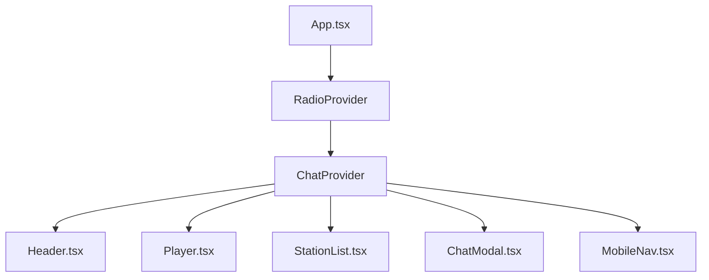
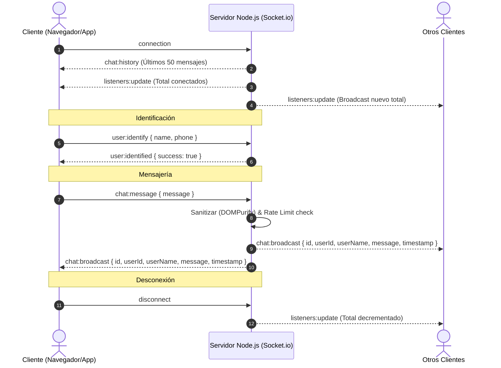

# 🏛️ ARQUITECTURA GENERAL DEL SISTEMA - RADIO PRO & TV LITE

> **Fuente Única de Verdad (Single Source of Truth - SSOT)**  
> Este documento define la arquitectura integral de la aplicación, el stack tecnológico, los flujos de datos, los eventos en tiempo real y el diseño para la integración del módulo de **Cine Compartido (WatchParty)** sin generar regresiones en el sistema actual.

---

## 1. Resumen del Proyecto y Propósito

### 1.1 Propósito
**Radio Pro & TV Lite** es una plataforma híbrida (Web, PWA y Android TV / TV Box mediante Capacitor) orientada al streaming continuo y con baja latencia de emisoras de radio y canales de televisión online (HLS, VideoJS, YouTube nocookie, iframes directos y proxies reversos). Además, integra salas de conversación y mensajería en tiempo real con soporte multimedia (audios de voz, notas, adjuntos y previsualizaciones).

### 1.2 Stack Tecnológico Principal

#### Frontend (SPA & Mobile / Smart TV)
- **Framework:** React 18.2 (TypeScript 5.2)
- **Bundler / Dev Server:** Vite 7.3
- **Estilos:** Tailwind CSS 3.4 + PostCSS + Variables CSS nativas para soporte dinámico de temas (`dark`, `light`, `youth`).
- **Reproducción Multimedia:**
  - `video.js` (v8.23) + `@videojs/http-streaming` (v3.17) para flujos HLS (.m3u8) y selección adaptativa de calidad.
  - `hls.js` (v1.4)
  - Soporte embebido para YouTube nocookie (`https://www.youtube-nocookie.com/embed/{id}`) e iframes dinámicos.
  - Audio HTML5 nativo con desbloqueo y síntesis vía Web Audio API (`AudioContext`).
- **Arrastre y Ordenamiento:** `@dnd-kit/core`, `@dnd-kit/sortable`, `@dnd-kit/utilities` (reordenación de emisoras y favoritos).
- **Iconografía:** `lucide-react`.
- **Empaquetado Nativo:** `@capacitor/core`, `@capacitor/android`, `@capacitor/cli` (v6.0) para builds de TV y móviles.

#### Backend & Networking
- **Entorno:** Node.js (CommonJS / Express 4.18)
- **Comunicación en Tiempo Real:** Socket.IO v4.6 (Servidor) / `socket.io-client` v4.8 (Cliente).
- **Seguridad y Moderación:** `isomorphic-dompurify` (sanitizado de mensajes HTML/SVG contra XSS), `bcryptjs` (hashing para anonimización de teléfonos), `express-rate-limit` (limitación de tasa de mensajes).
- **Proxies Reversos Integrados:** `http-proxy-middleware` v3.0 para eludir restricciones CORS/hotlinking de cadenas emisoras (ej. Repretel Canal 6 y `/proxy-stream`).
- **Persistencia en la Nube:** Supabase JS Client (`@supabase/supabase-js`) para catálogo maestro de emisoras, favoritos de usuario y sincronización de mensajes en la nube.

### 1.3 Puertos y Variables de Entorno

| Servicio | Puerto por Defecto | Variable de Entorno | Descripción |
| :--- | :--- | :--- | :--- |
| **Frontend (Vite)** | `5173` | `VITE_SOCKET_URL`, `VITE_SUPABASE_URL`, `VITE_SUPABASE_ANON_KEY` | Servidor de desarrollo Vite. |
| **Backend (Express + Sockets)** | `3001` | `PORT`, `CLIENT_URL` | API HTTP, Proxy Streams y Servidor Socket.IO. |
| **Capacitor TV Lite** | Android WebView | `CAP_WEB_DIR=dist-tv-lite` | Bundle optimizado sin dependencias pesadas para Smart TVs. |

### 1.4 Comandos de Ejecución y Compilación
- **Entorno Completo (Windows):** `start_app.bat` (levanta servidor Node en `:3001` y Vite en `:5173`).
- **Frontend Dev:** `npm run dev`
- **Frontend Build (Web):** `npm run build` (`tsc && vite build`)
- **Backend Dev:** `cd server && npm run dev` (usa `nodemon`)
- **Build Android TV Lite:** `npm run build:tv-lite` (ejecuta `scripts/prepare-tv-lite.js` y sincroniza con Capacitor).

---

## 2. Módulos y Componentes Existentes

```
src/
├── App.tsx                  # Orquestador raíz de la interfaz y layouts adaptativos
├── types.ts                 # Definiciones de tipo para Emisoras y Contexto de Radio
├── types/
│   ├── chat.ts              # Modelos para Chat, Usuarios, Identidad y Presencia
│   └── videojs.d.ts         # Declaraciones tipadas para Video.js
├── context/
│   ├── RadioContext.tsx     # Estado global de reproducción, catálogo y favoritos
│   └── ChatContext.tsx      # Estado global de mensajería, presencia, audio y notificaciones
├── components/
│   ├── Header.tsx           # Barra superior: navegación de categorías, pestañas, temas y chat
│   ├── Player.tsx           # Reproductor multimedia persistente (Audio / HLS / Iframe / YouTube)
│   ├── StationList.tsx      # Grid / Lista interactiva de emisoras con filtrado y DND
│   ├── StationManager.tsx   # Modal de administración (CRUD, reordenación, import/export y sync nube)
│   ├── ChatModal.tsx        # Interfaz de chat en vivo (mensajes, notas de voz, adjuntos, video preview)
│   ├── MobileNav.tsx        # Barra de controles y acceso rápido flotante para dispositivos móviles
│   ├── QualitySelector.tsx  # Selector de resolución para transmisiones HLS / VideoJS
│   ├── QualitySelectorPortal.tsx # Portal para incrustar el selector de calidad
│   ├── GeneralHelpModal.tsx # Guía de uso general para usuarios y Smart TV
│   ├── HelpModal.tsx        # Ayuda contextual de comandos y moderación del chat
│   ├── SidebarInfo.tsx      # Métricas e información técnica de la emisora activa
│   ├── ThemeToggle.tsx      # Conmutador de temas visuales
│   └── ChristmasWreath.tsx  # Decoración estacional
├── hooks/
│   ├── useVideoPlayer.ts    # Controlador de ciclo de vida de reproductores (Video.js / HTML5 / YouTube)
│   └── useTVRemote.ts       # Soporte de navegación para mandos a distancia D-Pad / Smart TV
└── services/
    ├── socketService.ts     # Wrapper cliente de Socket.IO singleton y reconexión
    └── supabase.ts          # Integración con tablas de Supabase y canales en tiempo real
```

### Detalle de Componentes Clave:
- **`App.tsx`:** Controla la disposición adaptable (Mobile vs Desktop), calcula dinámicamente alturas de encabezado (ResizeObserver), aplica temas en el DOM, inicializa soporte de mando a distancia (`useTVRemote`), y gestiona la apertura de modales (`ChatModal`, `StationManager`, `GeneralHelpModal`).
- **`Player.tsx`:** Aloja el contenedor del reproductor y delega en el hook [`useVideoPlayer`](file:///c:/radiofm/src/hooks/useVideoPlayer.ts). Detecta automáticamente si el stream es Audio HTML5, Video HLS (`video.js`), YouTube nocookie o un iframe externo. Permite controlar volumen con wheel del mouse, mute, play/pause y saltar emisoras.
- **`ChatModal.tsx`:** Modal de chat ultra-completo con soporte para detección de enlaces de YouTube (convirtiéndolos en tarjetas reproducibles en un clic), grabación de audio por micrófono, compresión y subida de archivos adjuntos, notificaciones por audio sintetizado y filtros antispam.
- **`StationList.tsx`:** Presenta las tarjetas de emisoras organizadas por categorías o favoritos con soporte de arrastre (`@dnd-kit`) para reordenar la grilla personalizada.
- **`StationManager.tsx`:** Panel administrativo para agregar, modificar, borrar y sincronizar emisoras locales directamente con la base de datos de Supabase.

---

## 3. Estado Global y Gestión de Contextos

La aplicación implementa una arquitectura desacoplada basada en Contextos de React + Caché Local Híbrida (`localStorage` + `Supabase`).



### 3.1 `RadioContext` ([`RadioContext.tsx`](file:///c:/radiofm/src/context/RadioContext.tsx))
- **Objetivo:** Orquestar el catálogo de canales y la estación en reproducción.
- **Estrategia Híbrida:**
  1. *0ms Start:* Lee inmediatamente de `localStorage` (`'radioStations'`).
  2. *Sync Nube:* Consulta `fetchStationsFromCloud()` y se suscribe a cambios en tiempo real vía `subscribeToStationsChanges()`.
  3. *Fallback:* Si no hay conexión ni caché, recurre a `/stations.json`.
- **Estructura Clave:**
  ```typescript
  export interface Station {
      id: string;
      name: string;
      url: string;
      logo: string;
      country: string;
      type: 'audio' | 'video';
      iframeUrl?: string;
      useProxy?: boolean;
      category?: string;
      embedCanal?: string;
  }
  ```

### 3.2 `ChatContext` ([`ChatContext.tsx`](file:///c:/radiofm/src/context/ChatContext.tsx))
- **Objetivo:** Manejar el estado de conectividad en tiempo real, identidad anónima/identificada del usuario, contador de usuarios conectados, historial de mensajes, eventos de escritura (typing) y sonidos de alerta.
- **Canales de Sincronización:** Emplea tanto [`socketService.ts`](file:///c:/radiofm/src/services/socketService.ts) para sockets directos en servidor local/LAN, como canales de Supabase Realtime (`subscribeToChatMessages`, `subscribeToOnlineListeners`) para persistencia global distribuida.

---

## 4. Infraestructura de Sockets y Eventos

El backend en [`server/index.js`](file:///c:/radiofm/server/index.js) y el cliente en [`src/services/socketService.ts`](file:///c:/radiofm/src/services/socketService.ts) implementan la siguiente especificación de eventos:



### Tabla de Eventos de Socket.IO Existentes

| Nombre de Evento | Dirección | Payload | Propósito |
| :--- | :--- | :--- | :--- |
| `user:identify` | Cliente → Servidor | `{ name: string, phone?: string }` | Registra el alias y hash del usuario. |
| `user:identified`| Servidor → Cliente | `{ success: boolean }` | Confirma registro de identidad en memoria. |
| `chat:message` | Cliente → Servidor | `{ message: string }` | Envía mensaje al chat general con rate limit. |
| `chat:broadcast`| Servidor → Todos | `ChatMessage` | Distribución global de mensaje sanitizado. |
| `chat:history` | Servidor → Cliente | `ChatMessage[]` | Reenvía los últimos 50 mensajes al conectar. |
| `listeners:update`| Servidor → Todos | `number` | Contador reactivo de sockets activos conectados. |
| `error` | Servidor → Cliente | `string` | Notifica infracciones de rate limit o validación. |

---

## 5. Puntos de Extensión para "Cine Compartido (WatchParty)"

Para que el nuevo módulo **Cine Compartido (WatchParty)** funcione de manera impecable y sin fricción técnica con el resto de la aplicación, se establecen los siguientes puntos de integración:

### 5.1 Arquitectura del Módulo WatchParty
El Cine Compartido permitirá a dos o más usuarios sincronizar la reproducción de un canal/video en tiempo real (Play, Pause, Seek, Cambio de Emisora/Película) junto con una sala de chat o comentarios sincronizados.

```mermaid
graph LR
    subgraph Frontend
        WPM[WatchPartyModal.tsx] --> WPS[watchPartyService / Sockets]
        WPM --> PlayerSync[Sync Controller con Player.tsx / RadioContext]
    end
    subgraph Backend
        WPS --> WPRoomEngine[Room Manager en server/index.js]
        WPRoomEngine --> SyncBroadcast[Emit a room: watchparty:{roomId}]
    end
```

### 5.2 Nuevos Archivos Propuestos
1. **`src/types/watchparty.ts`**:
   - `WatchPartyRoom`: `{ id: string, name: string, hostId: string, currentStation: Station, playbackState: 'playing' | 'paused', currentTime: number, members: WatchPartyMember[] }`.
   - `WatchPartyAction`: Comandos de sincronización (`play`, `pause`, `seek`, `change_station`).
2. **`src/components/WatchPartyModal.tsx`**:
   - Modal flotante o incrustado que muestra el código/enlace de la sala, lista de miembros en la sesión, controles de anfitrión (Host Controls), toggle de sincronización forzada ("Seguir al Anfitrión") y chat rápido de la sala.
3. **`src/services/watchPartySocket.ts`**:
   - Módulo que extiende `socketService.ts` o gestiona los eventos de la sala mediante `socket.io` namespaces o rooms (`socket.join('watchparty:${roomId}')`).

### 5.3 Especificación de Nuevos Eventos de Socket (Propuesta limpia)

| Evento | Dirección | Payload | Acción |
| :--- | :--- | :--- | :--- |
| `watchparty:create` | Cliente → Servidor | `{ roomName: string, station: Station }` | El servidor genera `roomId` y asigna al creador como `host`. |
| `watchparty:join` | Cliente → Servidor | `{ roomId: string, userName: string }` | El cliente se suscribe a la sala `socket.join(roomId)`. |
| `watchparty:sync:state` | Servidor → Cliente | `{ station: Station, isPlaying: boolean, currentTime: number }` | Envía el estado actual al cliente que recién se une. |
| `watchparty:action` | Cliente (Host) → Servidor | `{ roomId: string, action: 'play' \| 'pause' \| 'seek' \| 'change_station', payload: any }` | Notifica un cambio en la reproducción del anfitrión. |
| `watchparty:broadcast:action` | Servidor → Miembros de la sala | `{ action: string, payload: any, senderId: string }` | Notifica a todos los clientes de la sala para sincronizar `RadioContext` y `videoRef`. |
| `watchparty:leave` | Cliente → Servidor | `{ roomId: string }` | Abandona la sala; si es el host, reasigna o cierra la sala. |

### 5.4 Estrategia de No-Regresión en Componentes Existentes
- **En `App.tsx`:** Solo se añade un estado booleano `isWatchPartyOpen` y el botón de apertura en el [`Header.tsx`](file:///c:/radiofm/src/components/Header.tsx) y [`MobileNav.tsx`](file:///c:/radiofm/src/components/MobileNav.tsx).
- **En `Player.tsx` / `useVideoPlayer.ts`:**
  - El Cine Compartido consume la función expuesta `playStation(station)` y el control de reproducción de `RadioContext`.
  - Para soporte de sincronización de tiempo (`seek` / `currentTime`), se creará una interfaz ligera para consultar o asignar `videoRef.current.currentTime` sin alterar la lógica de reconexión HLS ni los proxies existentes.
- **En `server/index.js`:**
  - Se utiliza el aislamiento nativo de salas de Socket.IO: `socket.join(roomId)` y `socket.to(roomId).emit(...)`. No interfiere con el canal global `chat:message` ni con el rate limiter de la sala general.

---

## 6. Convenciones de Mantenimiento y Buenas Prácticas
1. **Sanitización Obligatoria:** Todo mensaje o dato proveniente del cliente en salas de Cine Compartido debe pasar por validación de tamaño y DOMPurify.
2. **Respaldo Offline / Resiliencia:** El reproductor debe mantener la capacidad de funcionar de forma autónoma si el usuario se desconecta de la sala o si el backend se reinicia.
3. **Compatibilidad Smart TV:** Las nuevas interfaces de Cine Compartido deben ser compatibles con navegación por teclado/D-Pad (flechas, Enter, Back) según las directrices de `useTVRemote.ts`.
