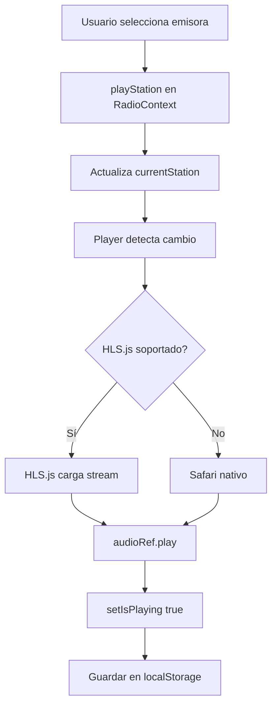
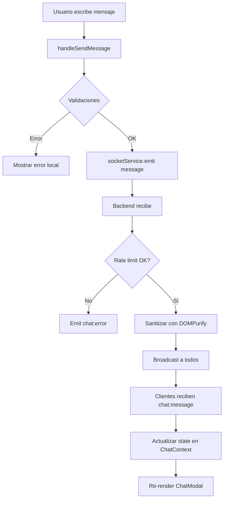
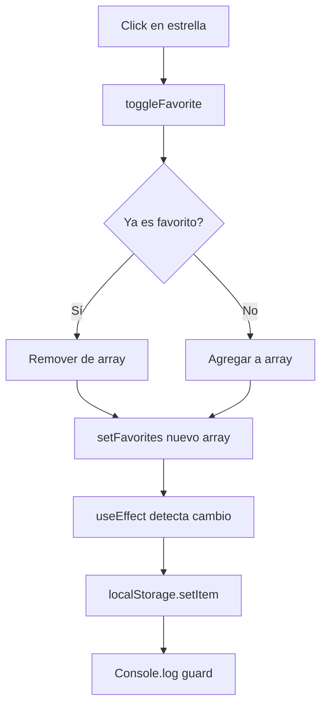

# 📚 Guía Técnica - Radio Streaming Pro

> Documentación técnica completa sobre la arquitectura, implementación y funcionamiento interno de la aplicación.

## 📋 Índice

1. [Arquitectura General](#arquitectura-general)
2. [Stack Tecnológico](#stack-tecnológico)
3. [Frontend Detallado](#frontend-detallado)
4. [Backend Detallado](#backend-detallado)
5. [Flujos de Datos](#flujos-de-datos)
6. [Persistencia](#persistencia)
7. [Comunicación en Tiempo Real](#comunicación-en-tiempo-real)
8. [Optimizaciones](#optimizaciones)
9. [Decisiones de Diseño](#decisiones-de-diseño)

---

## Arquitectura General

### Diagrama de Componentes

```
┌─────────────────────────────────────────────────────────┐
│                      FRONTEND (React)                    │
│  ┌────────────┐  ┌──────────────┐  ┌─────────────────┐ │
│  │   Header   │  │    Player    │  │  StationList   │ │
│  └────────────┘  └──────────────┘  └─────────────────┘ │
│  ┌────────────┐  ┌──────────────┐  ┌─────────────────┐ │
│  │ ChatModal  │  │  MobileNav   │  │  ThemeToggle   │ │
│  └────────────┘  └──────────────┘  └─────────────────┘ │
│                                                          │
│  ┌──────────────────────────────────────────────────┐  │
│  │         Context Providers (Estado Global)         │  │
│  │  • RadioContext (Audio, Emisoras, Favoritos)     │  │
│  │  • ChatContext (Mensajes, Usuarios, Socket)      │  │
│  └──────────────────────────────────────────────────┘  │
└─────────────────────────────────────────────────────────┘
                            │
                            │ HTTP / WebSocket
                            ▼
┌─────────────────────────────────────────────────────────┐
│                   BACKEND (Node.js)                      │
│  ┌──────────────┐  ┌──────────────┐  ┌──────────────┐ │
│  │   Express    │  │  Socket.IO   │  │     CORS     │ │
│  │   (Static)   │  │  (Real-time) │  │   (Security) │ │
│  └──────────────┘  └──────────────┘  └──────────────┘ │
│                                                          │
│  ┌──────────────────────────────────────────────────┐  │
│  │            Middleware & Utilities                 │  │
│  │  • Rate Limiter (express-rate-limit)            │  │
│  │  • DOMPurify (XSS Prevention)                   │  │
│  │  • bcrypt (Phone Number Hashing)                │  │
│  └──────────────────────────────────────────────────┘  │
└─────────────────────────────────────────────────────────┘
                            │
                            ▼
                   ┌─────────────────┐
                   │   localStorage   │
                   │  (Client-side)   │
                   └─────────────────┘
```

---

## Stack Tecnológico

### Frontend

| Tecnología | Versión | Propósito |
|-----------|---------|-----------|
| **React** | 18.3.1 | UI Framework |
| **TypeScript** | 5.6.2 | Type Safety |
| **Vite** | 5.4.11 | Build Tool & Dev Server |
| **Tailwind CSS** | 3.4.1 | Styling |
| **HLS.js** | 1.5.18 | Audio Streaming (HLS Protocol) |
| **Socket.IO Client** | 4.8.1 | WebSocket Client |
| **Lucide React** | ^0.344.0 | Icon Library |
| **date-fns** | ^2.30.0 | Date Formatting |

### Backend

| Tecnología | Versión | Propósito |
|-----------|---------|-----------|
| **Node.js** | 18+ | Runtime |
| **Express** | 4.21.1 | HTTP Server |
| **Socket.IO** | 4.8.1 | WebSocket Server |
| **CORS** | 2.8.5 | Cross-Origin Resource Sharing |
| **bcrypt** | 5.1.1 | Password/Data Hashing |
| **DOMPurify** | 3.2.2 | XSS Prevention |
| **express-rate-limit** | 7.4.1 | Rate Limiting |
| **dotenv** | 16.4.7 | Environment Variables |

---

## Frontend Detallado

### Gestión de Estado (Context API)

#### RadioContext

**Ubicación**: `src/context/RadioContext.tsx`

**Responsabilidades**:
- Gestión de emisoras (lista, actual, recientes)
- Control de reproducción (play/pause, volumen)
- Gestión de favoritos
- Persistencia en localStorage

**Estado**:
```typescript
interface RadioContextType {
    stations: Station[];           // Todas las emisoras
    currentStation: Station | null; // Emisora actual
    isPlaying: boolean;            // Estado de reproducción
    volume: number;                // Volumen (0-1)
    favorites: string[];           // IDs de favoritos
    recentStations: Station[];     // Últimas 10 emisoras
    isLoading: boolean;
    error: string | null;
    
    // Métodos
    playStation: (station: Station) => void;
    togglePlay: () => void;
    setVolume: (volume: number) => void;
    toggleFavorite: (stationId: string) => void;
    nextStation: () => void;
    prevStation: () => void;
    addStation: (station: Station) => void;
    removeStation: (stationId: string) => void;
    updateStation: (station: Station) => void;
}
```

**Características clave**:
1. **Lazy Initialization**: Los estados `stations`, `volume` y `favorites` se inicializan con funciones que leen de localStorage
2. **Efectos de Guardado**: useEffect hooks guardan automáticamente en localStorage cuando cambian
3. **Logs de Debug**: Console.logs para rastrear problemas de persistencia

#### ChatContext

**Ubicación**: `src/context/ChatContext.tsx`

**Responsabilidades**:
- Conexión con Socket.IO
- Gestión de mensajes
- Identificación de usuario
- Contador de mensajes no leídos
- Estado de conexión

**Estado**:
```typescript
interface ChatContextType {
    messages: ChatMessage[];
    onlineListeners: number;
    connectionStatus: 'connected' | 'disconnected';
    userIdentity: UserIdentity | null;
    isIdentified: boolean;
    error: string | null;
    unreadCount: number;
    
    // Métodos
    sendMessage: (message: string) => void;
    identify: (identity: UserIdentity) => void;
    clearMessages: () => void;
    logout: () => void;
    setModalOpen: (isOpen: boolean) => void;
}
```

**Características clave**:
1. **Re-identificación Automática**: Al reconectar, re-envía la identidad guardada en localStorage
2. **Tracking de No Leídos**: Usa localStorage para rastrear el último conteo de mensajes leídos
3. **Auto-clear de Errores**: Errores se limpian automáticamente después de 5 segundos

### Componentes Principales

#### Player.tsx

**Funcionalidad**:
- Reproduce audio usando HLS.js
- Control de volumen con slider
- Selector de emisoras (dropdown)
- Botón de favorito
- Visualización de estado (reproduciendo/pausado/cargando)

**HLS.js Integration**:
```typescript
useEffect(() => {
    if (currentStation && audioRef.current) {
        if (Hls.isSupported()) {
            const hls = new Hls();
            hls.loadSource(currentStation.stream);
            hls.attachMedia(audioRef.current);
            // ...
        } else if (audioRef.current.canPlayType('application/vnd.apple.mpegurl')) {
            // Safari nativo
            audioRef.current.src = currentStation.stream;
        }
    }
}, [currentStation]);
```

#### ChatModal.tsx

**Modos**:
1. **No identificado**: Muestra formulario de identific ación
2. **Identificado**: Muestra chat completo

**Features**:
- Auto-scroll al final cuando llegan mensajes nuevos
- Rate limiting visual (cooldown de 6 segundos)
- Indicador de conexión
- Contador de caracteres (máx 500)
- Botón de logout
- Botón de limpiar chat
- Mensajes propios vs ajenos (diferentes estilos)

**Control de Apertura**:
```typescript
// Props opcionales para control externo
interface ChatModalProps {
    externalOpen?: boolean;
    onOpenChange?: (open: boolean) => void;
}
```

#### MobileNav.tsx

**Layout**:
```
[Tema] ←----[← Play →]----→ [Chat]
```

**Características**:
- Solo visible en `md:hidden` (móviles)
- Iconos outline grises (`strokeWidth: 1.5`)
- Badge de mensajes no leídos en chat
- Botón de tema con icono Palette
- Controles centrados con flexbox

**Diseño Visual**:
- Fondo: `bg-[var(--dark-surface)]`
- Bordes: `border-t border-[var(--dark-border)]`
- Efectos: `active:opacity-50` en todos los botones
- Textos: `text-[10px] text-gray-400`

### Custom Hooks

#### useTVRemote.ts

**Ubicación**: `src/hooks/useTVRemote.ts`

**Funcionalidad**:
```typescript
export const useTVRemote = () => {
    const { nextStation, prevStation } = useRadio();

    useEffect(() => {
        const handleKeyDown = (e: KeyboardEvent) => {
            switch (e.key) {
                case 'ArrowLeft':
                    e.preventDefault();
                    prevStation();
                    break;
                case 'ArrowRight':
                    e.preventDefault();
                    nextStation();
                    break;
                // ArrowUp/Down: scroll natural
            }
        };

        window.addEventListener('keydown', handleKeyDown);
        return () => window.removeEventListener('keydown', handleKeyDown);
    }, [nextStation, prevStation]);
};
```

**Auto-focus**:
- Timer de inactividad de 6 segundos
- Al expirar, hace focus en el `<select>` de emisoras
- Se resetea con cualquier tecla presionada

### Servicios

#### socketService.ts

**Ubicación**: `src/services/socketService.ts`

**Configuración Dinámica**:
```typescript
const SERVER_URL = import.meta.env.PROD 
    ? undefined  // Mismo origin en producción
    : (import.meta.env.VITE_SOCKET_URL || 'http://localhost:3001');
```

**Eventos Manejados**:
- `connect` / `disconnect`: Estado de conexión
- `chat:message`: Nuevo mensaje recibido
- `chat:error`: Error del servidor
- `listeners:count`: Actualización de contador

**Métodos Públicos**:
```typescript
socketService.connect()
socketService.disconnect()
socketService.emit(event, data)
socketService.on(event, callback)
socketService.off(event, callback)
```

---

## Backend Detallado

### Servidor Principal (server/index.js)

**Estructura**:
```javascript
const express = require('express');
const { Server } = require('socket.io');
const cors = require('cors');
const http = require('http');

const app = express();
const httpServer = http.createServer(app);
const io = new Server(httpServer, { cors: { origin: "*" } });
```

### CORS Configuration

**Estrategia**: Origin dinámico
```javascript
app.use(cors({
    origin: true,  // Refleja el origin de la solicitud
    credentials: true
}));
```

**Ventaja**: Permite conexiones desde:
- localhost (desarrollo)
- IPs LAN
- ngrok
- Dominios en producción

### Socket.IO Events

#### Servidor → Cliente

| Evento | Datos | Descripción |
|--------|-------|-------------|
| `chat:message` | `ChatMessage` | Nuevo mensaje broadcast a todos |
| `chat:error` | `string` | Error (ej: rate limit) |
| `listeners:count` | `number` | Número de usuarios conectados |

#### Cliente → Servidor

| Evento | Datos | Validación |
|--------|-------|------------|
| `user:identified` | `UserIdentity` | Nombre (2-50 chars), Teléfono opcional |
| `chat:message` | `string` | Longitud (1-500 chars), Sanitización |

### Rate Limiting

**Configuración**:
```javascript
const chatLimiter = rateLimit({
    windowMs: 60 * 1000,  // 1 minuto
    max: 10,               // 10 mensajes
    message: 'Demasiados mensajes. Espera un momento.'
});
```

**Aplicación**:
- Por Socket.IO connection
- Usa un WeakMap para trackear por socket
- Se resetea al minuto

### Sanitización de Mensajes

```javascript
const DOMPurify = require('isomorphic-dompurify');

const sanitizedMessage = DOMPurify.sanitize(messageText, {
    ALLOWED_TAGS: [],  // Sin HTML
    KEEP_CONTENT: true
});
```

### Hash de Teléfonos

```javascript
const bcrypt = require('bcrypt');

if (phone) {
    hashedPhone = await bcrypt.hash(phone, 10);
}
```

**Razón**: Privacidad - los números nunca se guardan en texto plano

### Servir Frontend Estático

```javascript
app.use(express.static(path.join(__dirname, '../dist')));

app.get('*', (req, res) => {
    res.sendFile(path.join(__dirname, '../dist/index.html'));
});
```

**Ventaja**: Un solo servidor para desarrollo y producción

---

## Flujos de Datos

### Flujo de Reproducción de Audio



### Flujo de Chat



### Flujo de Favoritos



---

## Persistencia

### localStorage Schema

```typescript
// Clave: 'radioStations'
Station[] = [
    {
        id: string,
        name: string,
        stream: string,
        genre: string,
        logo?: string
    },
    // ...
]

// Clave: 'favorites'
string[] = ['station-id-1', 'station-id-2', ...]

// Clave: 'volume'
string = '0.7'  // Flotante como string

// Clave: 'lastStationId'
string = 'station-id'

// Clave: 'chatIdentity'
UserIdentity = {
    name: string,
    phone?: string
}

// Clave: 'theme'
'dark' | 'light' | 'youth'

// Clave: 'lastReadMessageCount'
string = '15'  // Para tracking de no leídos

// Clave: 'radioInitialized'
'true'  // Flag de primera ejecución
```

### Estrategia de Inicialización

```typescript
const [favorites, setFavorites] = useState<string[]>(() => {
    const saved = localStorage.getItem('favorites');
    if (saved) {
        try {
            return JSON.parse(saved);
        } catch (e) {
            console.error('Failed to parse favorites', e);
        }
    }
    return [];
});
```

**Ventaja**: Solo lee localStorage una vez, no en cada render

---

## Comunicación en Tiempo Real

### Arquitectura Socket.IO

**Rooms**: Todos los usuarios están en un room global implícito

**Eventos de Lifecycle**:
```javascript
io.on('connection', (socket) => {
    console.log('User connected:', socket.id);
    
    // Enviar conteo actual
    io.emit('listeners:count', io.engine.clientsCount);
    
    socket.on('disconnect', () => {
        console.log('User disconnected:', socket.id);
        io.emit('listeners:count', io.engine.clientsCount);
    });
});
```

### Manejo de Reconexión

**Cliente**:
```typescript
useEffect(() => {
    const handleConnectionStatus = (isConnected: boolean) => {
        setConnectionStatus(isConnected ? 'connected' : 'disconnected');
        
        // Re-identificar automáticamente
        if (isConnected && userIdentity) {
            socketService.emit('user:identified', userIdentity);
        }
    };
    
    socketService.on('connect', () => handleConnectionStatus(true));
    socketService.on('disconnect', () => handleConnectionStatus(false));
}, [userIdentity]);
```

---

## Optimizaciones

### Performance

1. **Lazy Loading de useState**:
   - Evita lecturas innecesarias de localStorage en cada render
   
2. **Memoización implícita**:
   - Context Providers solo re-renderizan cuando cambia su value
   
3. **Event Delegation**:
   - Un solo listener de teclado en `useTVRemote`

4. **Debouncing en búsqueda**:
   - El filtro de emisoras usa el valor directo (sin debounce) porque la lista es pequeña

### Bundle Size

**Vite Optimizations**:
- Code splitting automático
- Tree shaking de dependencias no usadas
- Minificación con esbuild

**Resultado**:
- CSS: ~21 KB (gzipped: ~5 KB)
- JS: ~780 KB (gzipped: ~240 KB)

### Networking

1. **HLS Adaptativo**:
   - HLS.js ajusta calidad según ancho de banda
   
2. **Socket.IO Reconnection**:
   - Backoff exponencial automático
   
3. **CORS permisivo**:
   - Menos preflight requests

---

## Decisiones de Diseño

### ¿Por qué Context API en vez de Redux?

**Razones**:
1. Menor complejidad para estado moderado
2. No necesitamos time-travel debugging
3. Menos boilerplate
4. Better TypeScript inference

### ¿Por qué localStorage en vez de IndexedDB?

**Razones**:
1. Datos simples (JSON serializable)
2. No necesitamos queries complejas
3. API síncrona más simple
4. Soporte universal

### ¿Por qué HLS.js en vez de Audio nativo?

**Razones**:
1. Mejor compatibilidad cross-browser
2. Streaming adaptativo
3. Menos buffering
4. Fallback a nativo en Safari

### ¿Por qué Socket.IO en vez de WebSocket puro?

**Razones**:
1. Reconnection automática
2. Fallback a HTTP long-polling
3. Room management
4. Event-based API más limpia

### ¿Por qué Tailwind en vez de CSS-in-JS?

**Razones**:
1. Zero runtime overhead
2. Purging automático de CSS no usado
3. Design system mediante variables CSS
4. Mejor para temas dinámicos

### Temas con CSS Variables

```css
:root {
    --primary-color: #6366f1;
    --dark-bg: #0f172a;
    /* ... */
}

body.light-mode {
    --dark-bg: #f1f5f9;
    /* ... */
}

body.youth-mode {
    --primary-color: #00ff9d;
    /* ... */
}
```

**Ventaja**: Cambio de tema sin re-render, solo cambio de clase en `<body>`

---

## Guía para Extender la Aplicación

### Agregar una Nueva Emisora Predeterminada

**Archivo**: `src/data/defaultStations.ts`

```typescript
export const DEFAULT_STATIONS: Station[] = [
    // ...
    {
        id: 'nueva-emisora',
        name: 'Nueva Emisora',
        stream: 'https://stream-url.com/playlist.m3u8',
        genre: 'Rock',
        logo: '/logos/nueva.png' // opcional
    }
];
```

### Agregar un Nuevo Tema

1. **Definir variables en `src/index.css`**:
```css
body.nuevo-tema {
    --primary-color: #ff0000;
    --secondary-color: #00ff00;
    /* ... */
}
```

2. **Actualizar `ThemeToggle.tsx`**:
```typescript
type Theme = 'dark' | 'light' | 'youth' | 'nuevo';

const cycleTheme = () => {
    setTheme(prev => {
        if (prev === 'dark') return 'light';
        if (prev === 'light') return 'youth';
        if (prev === 'youth') return 'nuevo';
        return 'dark';
    });
};
```

### Agregar un Evento Socket.IO Nuevo

**Backend** (`server/index.js`):
```javascript
socket.on('custom:event', (data) => {
    // Validar data
    // Procesar
    io.emit('custom:response', result);
});
```

**Frontend** (`src/services/socketService.ts`):
```typescript
interface SocketEvents {
    'custom:event': (data: CustomData) => void;
    'custom:response': (result: CustomResult) => void;
}
```

**Context**:
```typescript
useEffect(() => {
    const handleCustomResponse = (result: CustomResult) => {
        // Actualizar estado
    };
    
    socketService.on('custom:response', handleCustomResponse);
    return () => socketService.off('custom:response', handleCustomResponse);
}, []);
```

---

## Debugging

### Habilitar Logs Detallados

**Socket.IO Client**:
```typescript
localStorage.setItem('debug', 'socket.io-client:*');
```

**RadioContext**:
- Ya tiene console.logs para favoritos
- Agregar más según necesidad

### Inspeccionar localStorage

```javascript
// En consola del navegador
Object.keys(localStorage).forEach(key => {
    console.log(key, localStorage.getItem(key));
});
```

### Monitoring de Socket.IO

**Backend**:
```javascript
io.on('connection', (socket) => {
    console.log('New connection:', {
        id: socket.id,
        handshake: socket.handshake,
        rooms: socket.rooms
    });
});
```

---

## Mejoras Futuras Sugeridas

1. **Búsqueda de radios en internet**:
   - Integrar API como Radio Browser
   - Permitir agregar emisoras desde búsqueda
   
2. **PWA (Progressive Web App)**:
   - Service Worker para cache
   - Offline capability
   - Instalable en home screen
   
3. **Historial de reproducción**:
   - Trackear tiempo de escucha por emisora
   - Estadísticas para el usuario
   
4. **Ecualizador**:
   - Web Audio API para EQ visual
   - Presets de ecualización
   
5. **Backend con Base de Datos**:
   - PostgreSQL/MongoDB para chat history
   - Persistir favoritos por usuario (auth)
   
6. **Testing**:
   - Jest + React Testing Library
   - Cypress para E2E
   
7. **CI/CD**:
   - GitHub Actions
   - Auto-deploy a servidor

---

## Conclusión

Esta aplicación está diseñada para ser:
- **Mantenible**: Código modular y bien documentado
- **Extensible**: Arquitectura que permite agregar features
- **Performante**: Optimizaciones en bundle y runtime
- **Segura**: Sanitización, rate limiting, CORS
- **Universal**: Funciona en desktop, móvil y Smart TV

Para cualquier duda técn ica, referirse a:
- Código fuente con comentarios JSDoc
- Este documento
- Console.logs de debug
- Documentación oficial de las librerías usadas

---

**Última actualización**: Noviembre 2024
